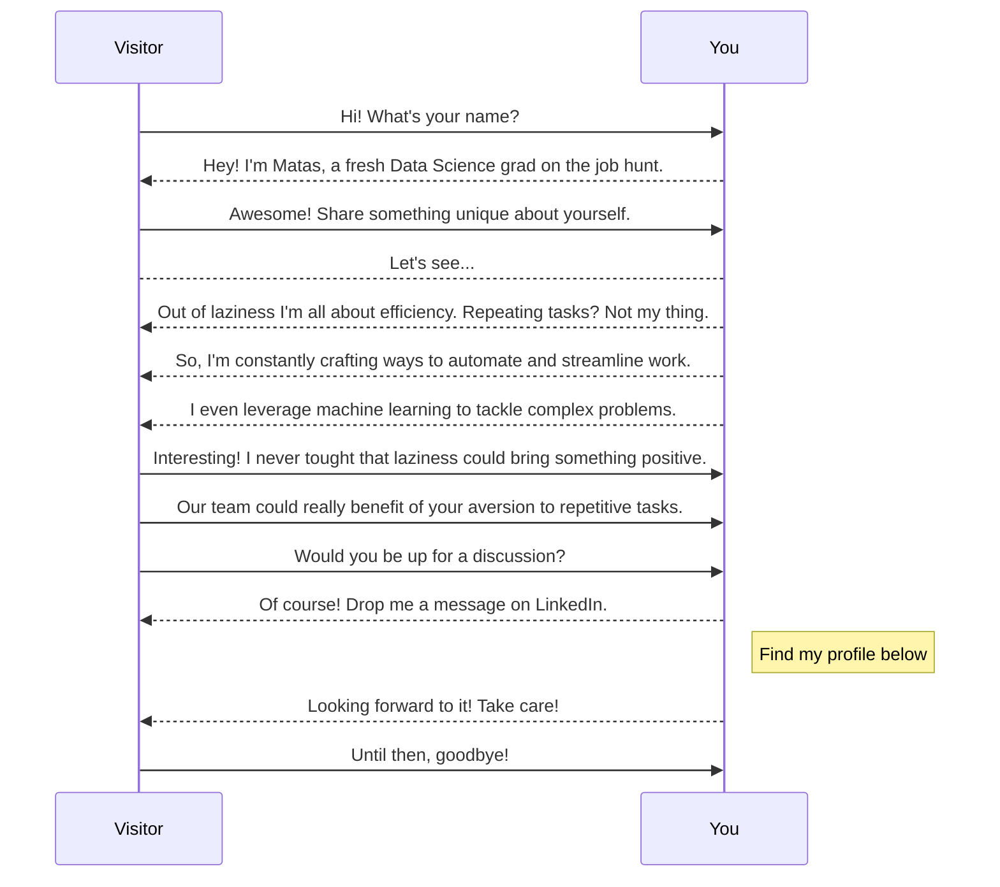

<h1 align="center">Hey there! 👋</h1>

<h3 align="left">My uploaded projects ordered chronologically:</h3>
1. k-means-clustering-algorithm.  
2. football_data_eda<be>
3. lending-club-dataset 
4. loan_default_prediction 
<h3 align="left">Languages and Tools:</h3>

         

<h3 align="left">Connect with me:</h3>

  
  

